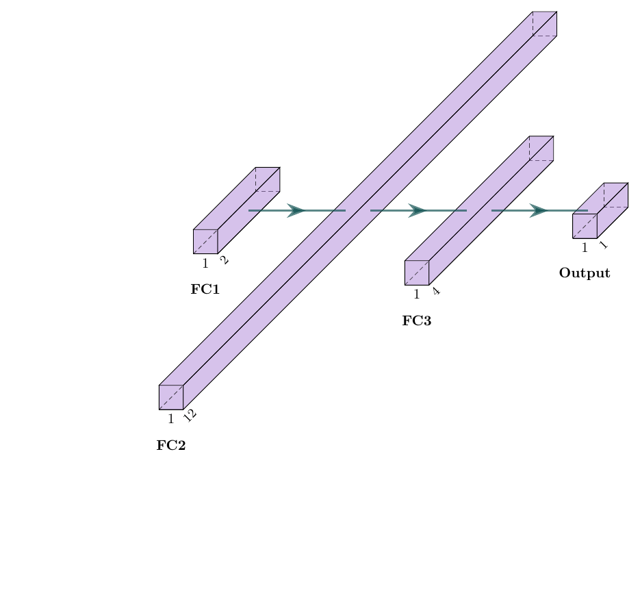

# Neural Network Visualizer

Use the [PlotNeuralNet](https://github.com/HarisIqbal88/PlotNeuralNet) tool to create a Latex neural network



## Usage

Edit [architecture/nn.py](architecture/nn.py)

Running via Docker

```sh
docker build -t neural-network-plot .
docker run -v "$(pwd)/architecture":/app/architecture/ neural-network-plot
```

Running via Docker Compose

```sh
docker compose up --build -d
docker compose down --volumes --rmi local
```
